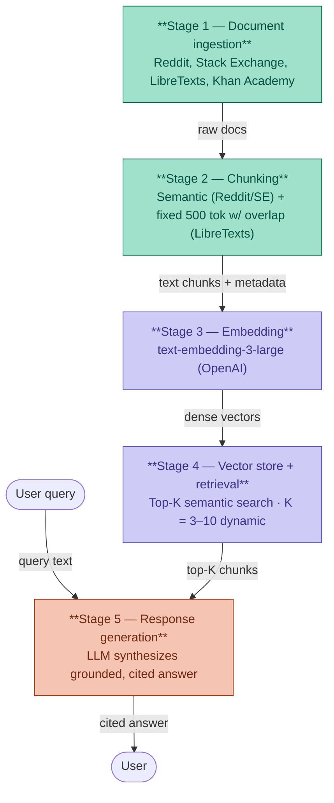

# Project 1 Planning: The Unofficial Guide

> Write this document before you write any pipeline code.
> Your spec and architecture diagram are what you'll use to direct AI tools (Claude, Copilot, etc.) to generate your implementation — the more specific they are, the more useful the generated code will be.
> Update the Retrieval Approach and Chunking Strategy sections if you change your approach during implementation.
> Update this file before starting any stretch features.

---

## Domain

<!-- What domain did you choose? Why is this knowledge valuable and hard to find through official channels? -->
The domain I have chosen is organic chemistry. Reason being the struggle many students experience going from general chemistry concepts to organic chemistry. Using organic chemistry subreddit, Khan Academy and LibreText, I'm hoping that students will be able to find specific answers to their question and/or watch a tutorial to gain an understanding of a defined topic.

---

## Documents

<!-- List your specific sources: URLs, subreddit names, forum threads, or file descriptions.
     Aim for at least 10 sources that together cover different subtopics or perspectives within your domain. -->

| #  | Resource                                                        | Source Type       | URL                                                                                                                          |
| -- | --------------------------------------------------------------- | ----------------- | ---------------------------------------------------------------------------------------------------------------------------- |
| 1  | r/OrganicChemistry — General mechanisms discussion              | Reddit            | [https://www.reddit.com/r/OrganicChemistry/](https://www.reddit.com/r/OrganicChemistry/)                                     |
| 2  | r/OrganicChemistry — SN1 vs SN2 vs E1 vs E2 threads             | Reddit            | [https://www.reddit.com/r/OrganicChemistry/](https://www.reddit.com/r/OrganicChemistry/)                                     |
| 3  | r/premed — "How did you survive organic chemistry?"             | Reddit            | [https://www.reddit.com/r/premed/](https://www.reddit.com/r/premed/)                                                         |
| 4  | r/Mcat — Organic chemistry strategy threads                     | Reddit            | [https://www.reddit.com/r/Mcat/](https://www.reddit.com/r/Mcat/)                                                             |
| 5  | Chemistry Stack Exchange — Resonance & carbocation stability    | Stack Exchange    | [https://chemistry.stackexchange.com/](https://chemistry.stackexchange.com/)                                                 |
| 6  | Chemistry Stack Exchange — R/S configuration in stereochemistry | Stack Exchange    | [https://chemistry.stackexchange.com/](https://chemistry.stackexchange.com/)                                                 |
| 7  | LibreTexts — Nucleophilic Substitution chapter                  | Open Educational  | [https://chem.libretexts.org/Bookshelves/Organic_Chemistry](https://chem.libretexts.org/Bookshelves/Organic_Chemistry)       |
| 8  | LibreTexts — Stereochemistry chapter                            | Open Educational  | [https://chem.libretexts.org/](https://chem.libretexts.org/)                                                                 |
| 9  | OpenStax Chemistry — Organic compounds overview                 | Open Educational  | [https://openstax.org/books/chemistry-2e/pages/1-introduction](https://openstax.org/books/chemistry-2e/pages/1-introduction) |
| 10 | Khan Academy — Substitution and Elimination                     | Open Educational  | [https://www.khanacademy.org/science/organic-chemistry](https://www.khanacademy.org/science/organic-chemistry)               |
| 11 | Orgo Made Easy — Community Notes and Videos                     | Community / Video | [https://www.youtube.com/c/OrgoMadeEasy](https://www.youtube.com/c/OrgoMadeEasy)                                             |
| 12 | r/OrganicChemistry Wiki & Sidebar Resources                     | Reddit Wiki       | [https://www.reddit.com/r/OrganicChemistry/wiki](https://www.reddit.com/r/OrganicChemistry/wiki)                             |

---

## Chunking Strategy

<!-- How will you split documents into chunks?
     State your chunk size (in tokens or characters), overlap size, and explain why those
     numbers fit the structure of your documents.
     A review-heavy corpus warrants different chunking than a long FAQ. -->

**Chunk size:**
Chunk size: ~ 500 tokens

**Overlap:**
Overlap: ~ 100 tokens

**Reasoning:**
Since organic chemistry (OChem) answers can range from one-liners to multiline paragraphs, I think a hybrid chunking strategy wii be the most effective. I think a chunk size of about 500 tokens with an overlap of about 100 tokens ensures that answers are not lost at retrieval time. Another strategy is to add metadata tagging per chunk to help in improving answer quality.
---

## Retrieval Approach

<!-- Which embedding model are you using (e.g., all-MiniLM-L6-v2 via sentence-transformers)?
     How many chunks will you retrieve per query (top-k)?
     If you were deploying this for real users and cost wasn't a constraint, what tradeoffs
     would you weigh in choosing a different embedding model — context length, multilingual
     support, accuracy on domain-specific text, latency? -->

**Embedding model:**
Model: text-embedding-3-large, due its stronger performance on technical, domain-specific text and higher dimensional embeddings, which improve semantic similarity for nuanced OChem concepts like stereochemistry and reaction mechanisms.

**Top-k:**
The number of chunks that will be retrieved will be based on semantics, from low K value of  3-5 for simple short answer questions to 8-10 for more detailed answers that may involve diagrams.
K = 3–5 dynamic, for simple conceptual questions. 
K = 8–10 for complex multi-step mechanism questions. 
Note: embeddings retrieve text only; mechanism diagrams are represented through their text descriptions.

**Production tradeoff reflection:**
If deployed for real users, key tradeoffs in model selection would include:
- Latency vs. accuracy: text-embedding-3-large is slower than the small variant; 
  a high-traffic system may prefer the small model with reranking instead.
- Multilingual support: switching to multilingual-e5-large would better serve 
  non-English speaking students at the cost of some domain-specific accuracy.
- Context length: longer context models reduce the risk of truncating a full 
  mechanism explanation mid-chunk.
---

## Evaluation Plan

<!-- List your 5 test questions with their expected correct answers.
     Questions should be specific enough that you can judge whether the system's response
     is right or wrong. "What are good dining halls?" is too vague.
     "What do students say about wait times at [dining hall name] during lunch?" is testable. -->

| # | Test Question                                                                          | Expected Correct Answer                                                                                                                                                                                                                                                   |
| - | -------------------------------------------------------------------------------------- | ------------------------------------------------------------------------------------------------------------------------------------------------------------------------------------------------------------------------------------------------------------------------- |
| 1 | What is the difference between SN1 and SN2 reaction mechanisms?                        | **SN1** is a two-step mechanism proceeding through a carbocation intermediate, favored by tertiary substrates and polar protic solvents.  **SN2** is a one-step concerted mechanism with backside attack, favored by primary substrates and polar aprotic solvents. |
| 2 | How do students recommend memorizing reaction mechanisms in organic chemistry?         | Students recommend drawing mechanisms repeatedly by hand, focusing on electron flow with curved arrows, grouping reactions by mechanism type rather than memorizing individually, and using spaced repetition.                                                            |
| 3 | What factors determine whether E1 or E2 elimination will occur?                        | **E1** is favored by tertiary substrates, weak bases, and polar protic solvents.  **E2** is favored by strong bulky bases and requires an anti-periplanar arrangement of the leaving group and beta hydrogen.                                                       |
| 4 | What do students say is the hardest topic in Orgo 1 and how did they get through it?   | Students commonly cite stereochemistry (R/S configuration, enantiomers, diastereomers) as the hardest topic. Strategies include building molecular models, practicing with Fischer projections, and working through many practice problems.                               |
| 5 | How does resonance stabilization affect carbocation stability?                         | Greater resonance delocalization stabilizes carbocations more. Allylic and benzylic carbocations are especially stable because the positive charge is delocalized across multiple atoms through pi systems.                                                               |
| 6 | What is the difference between a nucleophile and an electrophile in organic chemistry? | A nucleophile is an electron-rich species that donates electrons to form a bond, while an electrophile is an electron-poor species that accepts electrons. Nucleophiles attack electrophilic carbon centers.                                                              |
| 7 | What study strategies do premed students use specifically for orgo exam preparation?   | Premed students recommend doing every practice exam available, focusing on mechanism patterns over memorization, forming study groups for problem-solving, reviewing professor-specific exam styles, and not falling behind since topics build on each other.             |
| 8 | How do students describe the difficulty difference between Orgo 1 and Orgo 2?          | Students generally say Orgo 2 introduces more complex reactions (carbonyls, aromatic chemistry, multistep synthesis), but students who mastered mechanism thinking in Orgo 1 often find it more manageable. The volume of reactions increases significantly.              |

---

## Anticipated Challenges

<!-- What could go wrong? Name at least two specific risks with reasoning.
     Consider: noisy or inconsistent documents, missing source attribution, off-topic
     retrieval, chunks that split key information across boundaries. -->

1. Nuanced / Visual questions - model not being unable to answer question(s) that aren't easily described through text

2. Terminology mismatch - model may not be able to understand common terminology that is not present in its training data. Consequently, the answer generated maybe inaccurate. For example, both Claude and ChatGPT refer to organic chemistry as 'orgo', I have alwaysed used the term 'OChem' instead. 

## AI generated( listed those above and asked for additional challenge considerations)

1. Source Quality Variance
Reddit and forums contain both excellent advice and confidently wrong information. Your RAG system has no built-in way to distinguish a knowledgeable upperclassman from someone who failed orgo twice. Without source quality filtering, bad chunks can surface as grounded answers.
2. Chunk Boundary Problems
A mechanism explanation that gets split mid-step across two chunks may return only half the context. The retrieved chunk looks relevant but the answer generated from it will be incomplete or misleading.
3. Query-Chunk Vocabulary Gap
A student asks "why does the ring flip in cyclohexane?" but your chunks use the phrase "chair conformation interconversion." The embedding similarity may be low enough that the right chunk never gets retrieved — even though it directly answers the question.
4. Outdated or Course-Specific Information
Some sources may reference a specific professor's exam format, a textbook edition, or a curriculum that differs from the student using the system. Retrieved chunks may be accurate but irrelevant to the user's actual course.
5. Multi-hop Questions
Some orgo questions require connecting multiple concepts — "Why does an SN2 reaction fail on neopentyl bromide?" requires understanding both steric hindrance AND the SN2 mechanism. A single top-K retrieval pass may not surface all the necessary context.
6. Overconfident Generation
Even when retrieved chunks are weak or only partially relevant, LLMs tend to generate fluent, confident-sounding answers. Without a confidence score or citation check, students may trust a poorly grounded answer.

---

## Architecture

<!-- Draw a diagram of your pipeline showing the five stages:
     Document Ingestion → Chunking → Embedding + Vector Store → Retrieval → Generation
     Label each stage with the tool or library you're using.
     You can use ASCII art, a Mermaid diagram, or embed a sketch as an image.
     You'll use this diagram as context when prompting AI tools to implement each stage. -->

---

## AI Tool Plan

<!-- For each part of the pipeline below, describe:
     - Which AI tool you plan to use (Claude, Copilot, ChatGPT, etc.)
     - What you'll give it as input (which sections of this planning.md, which requirements)
     - What you expect it to produce
     - How you'll verify the output matches your spec

     "I'll use AI to help me code" is not a plan.
     "I'll give Claude my Chunking Strategy section and ask it to implement chunk_text()
     with my specified chunk size and overlap" is a plan. -->
Currently I'm using both Claude (primary) and ChaptGPT, to assist with the project.

**Milestone 3 — Ingestion and chunking:**
In this section, data ingestion and chunking were defined based on the topics. Since the subject of organic chemistry was chosen metadata tagging was partially implemented to allow to allow more refined question-answer prompt. 
The main challenged faced is Organic chemistry proved to be a challenging, for retrieval quality was directly tied to corpus coverage, queries with dedicated source pages returned medium-relevance results, whilst queries without matching chunks failed entirely. This highlights a core RAG limitation: reasoning is heavily based on its source documents.

**Milestone 4 — Embedding and retrieval:**
After testing with suggested model, all-MiniLM-L6-v2 (sentence transformers) I noticed that the distance score generated was poor. As a result, I changed to model to multi-qa-MiniLM-L6-cos-v1, which was better suited for the question-answer pair required and distance score results improved.

**Milestone 5 — Generation and interface:**
In this section, I stated explicitly not to allow hallucinations. In addition, I am adding grounding testing to show distance scores based on chunks. Gradio was used as an interface for testing.
